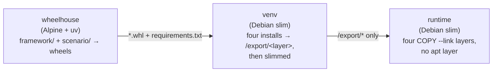

# Packing a scenario package into a container image

A scenario package created with `scenario-new` is a normal Python
distribution, so it can be shipped as a container image that carries the
framework, the scenario, its configs, and its CARLA client --
[typesafe_carla](https://github.com/hakuturu583/typesafe_carla), whose CPython
package is **compiled into the image** at build time.

The image is built by the `pack-scenario-image` composite action. Everything it
needs lives in the action's own directory, so it is meant to be referenced from
other repositories:

```yaml
- uses: hakuturu583/autoware_carla_scenario/.github/actions/pack-scenario-image@master
```

The ref is both the action version and the framework version that ends up in
the image — the runner checks the whole repository out alongside the action,
and the framework packages are built from that copy. Pin a release tag instead
of `main` for reproducible framework versions. Your own repository does not
have to contain this framework, or even be checked out.

## What the image contains

Only installed code:

| Present | Absent |
| --- | --- |
| `/opt/venv` — the framework, the scenario package, their dependencies (typesafe-carla and its Codon toolchain among them), and typesafe_carla's compiled CPython package | Source trees, `pyproject.toml`, tests, docs, git history |
| `ffmpeg`, when asked for | `uv`, wheels, build caches, a C compiler, any apt package at all |

The entry point is the `scenario` CLI and the working directory is `/work`,
where Hydra writes its run directory.

`/opt/venv` arrives as [four layers](#layer-layout), not one, so a client that
already holds another image built the same way pulls only what actually
differs.

## Stage layout

`.github/actions/pack-scenario-image/Dockerfile` runs three stages, each
handing the next strictly less than it was given:



`wheelhouse` is Alpine because everything it touches is pure Python — `uv
build` emits `py3-none-any` wheels for all three packages — so the stage needs
neither glibc nor a compiler, and nothing but the wheels survives it.

The runtime is **not** Alpine, and cannot be. `typesafe-carla` and its Codon
toolchain, `opencv-python-headless` and `simple-lanelet2` publish manylinux
wheels only. There is no musllinux wheel to fall back to, so a musl runtime
cannot install them at all. Debian slim is the smallest base that runs the
code.

The `venv` stage, unlike the runtime, installs `gcc`: typesafe_carla's CPython
package is not in its wheel but compiled once per installation
(`typesafe-codon pycarla`, ~15 minutes and ~8 GB of memory), and the image
does that at build time so that a container never does. The runtime sets
`TYPESAFE_CARLA_PYCARLA_DIR` to the build inside `/opt/venv` and
`TYPESAFE_CARLA_PYCARLA_BUILD=0`, so a missing or stale build is an
`ImportError` rather than a 15-minute compile on the first run.

## Layer layout

An image is pulled as a stack of layers, and a client downloads only the ones
it does not already have. A virtualenv shipped as a single `COPY` is a single
layer, so changing one line of a scenario means pulling all ~400 MB of it
again. The Dockerfile therefore installs `/opt/venv` in four steps and ships
each step as its own layer, ordered from the input that changes least often to
the one that changes on every commit:

| # | Layer | Holds | Rebuilt when |
| --- | --- | --- | --- |
| 1 | `deps` | The virtualenv and the framework's third-party dependency closure — typesafe-carla and its Codon toolchain, OpenCV, scipy, numpy, the matplotlib stack, … | `uv.lock`, `python-version` or the base image changes |
| 2 | `client` | typesafe_carla's compiled CPython package (`import typesafe_carla.carla as carla`) | Layer 1 changes |
| 3 | `framework` | `autoware-carla-scenario` | Framework code changes |
| 4 | `scenario` | The scenario wheel, plus any dependency it adds of its own | The scenario package changes |

(Before the move to typesafe_carla the dependency layer was ~400 MB and the
two framework and scenario layers ~2 MB and ~80 kB; the Codon toolchain adds
to the first, and the size of the compiled client has not been measured in
an image yet.)

Layer 2 is compiled from what layer 1 installed and nothing else, so the
build cache keeps it — and skips the ~15 minute compile — until `uv.lock`
moves typesafe-carla.

So editing a scenario and rebuilding transfers the fourth layer. Bumping the
framework transfers the third and fourth. Only a lock change moves the
dependencies and the client. The push is
incremental for the same reason: a registry that already holds a blob is sent
the new layer and nothing else.

### What makes it hold

Layer reuse is by digest, and a digest covers file metadata as well as content,
so two things could quietly defeat the split:

- **Install timestamps.** The same wheel installed twice produces the same
  bytes at different times, and that alone is a different layer.
  `venv-layer.sh` therefore stamps every exported file with one fixed timestamp
  (`LAYER_MTIME`, 2020-01-01 by default) as it captures it, and re-stamps
  afterwards whatever the slim pass rewrote. A rebuild from a cold cache
  reproduces layers 1, 3 and 4 byte for byte; the compiled client (layer 2) is
  only as reproducible as the Codon compiler's output, so a cold cache may
  give it a new digest.
- **The layers underneath.** A layer can only be reused together with its whole
  parent chain, so anything that varies has to sit *behind* the virtualenv
  rather than in front of it. The runtime stage therefore copies the four
  layers first and only then creates the user and installs `ffmpeg`: `apt`
  hands out whatever build it has today, and `useradd` writes the current date
  into `/etc/shadow`, which would otherwise put a fresh digest on every layer
  behind it. The copies use `COPY --link`, so each layer is built against an
  empty base and stays the same blob wherever it lands.

`slim-venv.py` runs once per layer rather than once over the virtualenv, so
stripping a shared object rewrites it inside the layer that installed it
instead of duplicating a stripped copy into a later one. The build then
reassembles the four trees exactly as the runtime stage stacks them and imports
the native extension modules from the result, so a file lost or shadowed by the
split fails the build rather than the container.

### Sharing the build cache

Layers are about the pull; `cache-scope` is the same idea for the build. It
defaults to one scope per image, but images that share a lock and framework
are the same build up to their scenario layer, so pointing several of them at
one scope lets the later ones restore the dependency and client stages instead
of resolving them — and compiling the client — again. The action reports the scope
it used, so a second build in the same workflow can just name the first's:

```yaml
- uses: ./.github/actions/pack-scenario-image
  id: first
  with:
    scenario-package-path: packages/first_scenario
    image: ghcr.io/my-org/first-scenario

- uses: ./.github/actions/pack-scenario-image
  with:
    scenario-package-path: packages/second_scenario
    image: ghcr.io/my-org/second-scenario
    cache-scope: ${{ steps.first.outputs.cache-scope }}
```

## Keeping the image small

Two things do the work, measured on a scaffolded package with the official
CARLA 0.10.0 client (before the move to typesafe_carla, whose Codon toolchain
adds to these totals):

| | virtualenv |
| --- | --- |
| Naive install | 565 MB |
| `opencv-python-headless` instead of `opencv-python` | 512 MB |
| …plus the `slim` pass | **413 MB** |

- **Headless OpenCV.** The framework's only OpenCV calls are `imencode` and
  `pointPolygonTest`; there is no `imshow` or `namedWindow` anywhere, so the GUI
  build's GTK/GStreamer payload is dead weight. Dropping it also removes the
  *last* external shared-library dependency: every `.so` in the venv now needs
  nothing beyond glibc, `libgcc_s`, `libstdc++` and `libz`, all of which the
  base image already has. The runtime therefore installs no apt packages and
  carries no apt layer unless `with-ffmpeg` is on.
- **The `slim` pass** (on by default, `slim: "false"` to disable) drops
  byte-code caches, vendored test suites, C headers, Cython sources and type
  stubs (29 MB), then runs `strip --strip-unneeded` over every bundled shared
  object (64 MB) — the manylinux wheels for scipy, numpy and OpenCV ship
  unstripped. Stripping leaves the dynamic symbol table intact.

    GNU binutils up to 2.40 — the version in Debian bookworm — rewrites some
    objects into a layout the kernel's ELF loader rejects with *"ELF load
    command address/offset not page-aligned"*; scipy's bundled OpenBLAS is one.
    So `slim-venv.py` re-reads every object it strips and restores the original
    unless each `PT_LOAD` segment still satisfies the loader's congruence rule.
    A newer binutils strips everything and restores nothing; on bookworm the
    one restored file costs about 2 MB. The build then imports the native
    extension modules and fails right there if anything did break.
- **Stage separation.** Wheels are built in a throwaway Alpine stage and the
  virtualenv in a throwaway Debian stage, so no source tree, wheel, build cache
  or copy of `uv` reaches the final image.

The [layer layout](#layer-layout) does not change any of these totals — the
same bytes are simply split across four layers instead of one, so that a
rebuild transfers only the layers that changed.

What is left is dominated by dependencies with no smaller variant: OpenCV,
scipy, numpy, and the matplotlib stack that `pyxodr` requires.

## Pinning the CARLA client — and everything else

The client is the `typesafe-carla` that `uv.lock` pins (CARLA UE5: the wheel's
LibCarla is built from a CARLA ref, which the build prints), compiled once
during the build and loaded before the image is finished. Nothing in the image
can change it afterwards. The default tags are `:latest` and the commit
(`:<sha>`); to see which client an image carries:

```bash
docker run --rm --entrypoint python ghcr.io/tier4/my-scenario:latest -c \
  "from importlib.metadata import version; from typesafe_carla import paths; print(version('typesafe-carla'), paths.native_info()['carla_git_ref'])"
```

The whole dependency tree is pinned, so the same ref rebuilt months
apart gives the same image: the build context carries `uv.lock`, the wheelhouse
stage exports it as a requirements file with `uv export --frozen`, and that
file is both what the dependency layer installs and what constrains the two
installs after it. This buys reproducibility rather than size — and, with the
timestamps normalised, it is what lets an unchanged dependency layer keep its
digest across rebuilds. Constraints only bound what is resolved, so a scenario
package that brings dependencies of its own still installs — they are the one
part that floats, and they land in the scenario layer.

## In a workflow

```yaml
jobs:
  pack:
    runs-on: ubuntu-latest
    permissions:
      contents: read
      packages: write
    steps:
      - uses: actions/checkout@v4

      - name: Log in to GHCR
        uses: docker/login-action@v3
        with:
          registry: ghcr.io
          username: ${{ github.actor }}
          password: ${{ secrets.GITHUB_TOKEN }}

      - name: Pack the scenario package
        uses: ./.github/actions/pack-scenario-image
        with:
          scenario-package-path: packages/my_scenario_package
          image: ghcr.io/${{ github.repository_owner }}/my-scenario
          push: "true"
```

The scenario package does not have to live in this repository — check it out
anywhere on the runner and point `scenario-package-path` at it.

### Inputs

`action.yml` carries the full list with defaults; these are the ones worth
explaining further:

| Input | Meaning |
| --- | --- |
| `scenario-package-path` | The generated package — the directory with its `pyproject.toml`. Required, and may sit outside this repository. |
| `framework-path` | uv workspace root supplying the framework. Defaults to the action's own checkout, which is what makes the pinned ref the framework version. Its members are read from `[tool.uv.workspace] members`, globs included. |
| `with-ffmpeg` | Installs ffmpeg for `CameraRecorder`. The only input that adds an apt layer. |
| `slim` | Strips the virtualenv (see above). On by default. |
| `cache-scope` | Cache key namespace. Defaults to one scope per image, so images built in the same workflow do not evict each other — give two images the same scope to [share it](#sharing-the-build-cache) instead. |

Outputs: `image-ref`, `tags`, `digest` (pushed images only), `cache-scope`.

### The smoke test

With `smoke-test: "true"` the action runs its `smoke-test.py` inside the
freshly built image and checks that

1. typesafe_carla's compiled CPython package loads without compiling anything
   (`TYPESAFE_CARLA_PYCARLA_BUILD=0`), and the official `carla` package is
   not installed,
2. the scenario package's `autoware_carla_scenario.scenarios` entry point loads
   and registers at least one scenario,
3. Hydra discovers `AutowareScenarioSearchPathPlugin`, so the package's
   `conf/` directory reaches the config search path, and
4. `scenario --help` composes a config without a CARLA server.

Check 3 is worth its keep: `hydra_plugins` is a namespace package that an
editable install resolves via `src/`, so losing it from the wheel breaks every
`scenario=<name>/…` override in the image while leaving development untouched.

## Building by hand

```bash
ACTION=.github/actions/pack-scenario-image

# 1. Assemble a minimal build context (framework + scenario, nothing else).
"$ACTION/assemble-context.sh" \
  --scenario ../my_scenario_package \
  --out /tmp/scenario-ctx

# 2. Build.
# Compiling the CARLA client takes ~15 minutes and ~8 GB of memory.
docker build \
  --file "$ACTION/Dockerfile" \
  --tag my-scenario:latest \
  /tmp/scenario-ctx

# 3. Verify.
docker run --rm -i --entrypoint python \
  my-scenario:latest - < "$ACTION/smoke-test.py"
```

## Running a scenario

The image holds the client, not the simulator, so point it at a CARLA server
and give it the map files:

```bash
docker run --rm \
  --network host \
  --volume "$PWD/maps:/maps:ro" \
  --volume "$PWD/outputs:/work/outputs" \
  --env NISHISHINJUKU_XODR_PATH=/maps/nishishinjuku_carla.xodr \
  --env NISHISHINJUKU_LANELET2_PATH=/maps/nishishinjuku.osm \
  my-scenario:latest \
  scenario=my_scenario/default map=nishishinjuku
```

Without `--network host`, pass the server address explicitly with
`server.host=<address> server.port=2000`. Hydra writes under the working
directory, so `/work` needs a volume for the results to outlive the container —
the image runs as UID 1000, which must be able to write to it.
