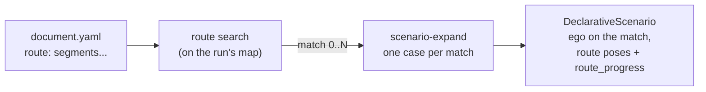

# Logical Scenarios from Routes

A *concrete* scenario names lanelets: the ego spawns on lanelet 242, an NPC
follows vertices in one map's coordinates. It runs on that map only.

A *logical* scenario describes the ego's drive as a **route pattern** -- "30 to
60 m of road with an oncoming lane, a signalised left turn with traffic coming
from the opposite approach, then up to 40 m out of it" -- and places every
other road user **relative to that route**. Any map with such a road can run
it: the route search finds every matching route of the map, and each match is
one concrete scenario.

This is the shape a recorded drive (a T4 scene) is transpiled into by
`scene_to_scenario_transpiler`: the ego's drive becomes the route pattern,
each NPC becomes a hidden entity that **appears** when the ego has progressed
to the point it was first seen, and then drives in `FOLLOW` mode along
waypoints that **advance on the ego's progress**.



## The document

Everything is in the [Scenario IR](scenario_editor.md) (`ScenarioDocument`).
A full example, using every feature this page describes:

```yaml
version: 1
id: logical_left_turn
title: Left turn with an oncoming car and a pedestrian
timeout_seconds: 60

# --- The ego's drive, as a pattern of road ------------------------------------
route:
  segments:                       # in driving order
    - kind: lane
      length: {min: 30, max: 60}  # m along the route; either bound optional
      lanes_left: {max: 0}        # same-direction lanes to the left (count range)
      lanes_right: {}             # {} = any
      opposite_lane: "yes"        # any | yes | no (bare YAML yes/no accepted)
      shape: straight             # any | straight | curved_left | curved_right
      stop_line: any              # at the segment's end (its last lanelet)
      traffic_light_stop_line: any
    - kind: junction
      turn: left                  # any | left | right | straight
      traffic_light: "yes"
      crossing_from_left: any
      crossing_from_right: any
      crossing_from_opposite: "yes"
      crosswalk_entry: any
      crosswalk_exit: "yes"
    - kind: lane
      length: {max: 40}
  ego_spawn_s: 5.0                # ego spawns 5 m along the route
  ego_goal: true                  # ego's goal = route end ...
  ego_goal_margin: 2.0            # ... less 2 m
  match_index: 0                  # which match an unexpanded run takes
  max_matches: 64                 # 1..1000
  seed: null                      # null: sorted order; int: shuffled with it

entities:
  - {id: ego, kind: ego, driven_by: autoware}   # no spawn/goal needed: the route gives them
  - id: oncoming
    kind: vehicle
    vehicle_type: vehicle.tesla.model3
    spawn: {hidden: true}         # parked out of the world; no lanelet needed
  - id: walker
    kind: pedestrian
    spawn: {hidden: true}

actions:
  # The oncoming car: appears when the ego is 40 m short of the junction,
  # 30 m before the junction on the opposite approach, at 8 m/s; drives FOLLOW
  # mode and waits at the junction entry until the ego is 5 m from it.
  - id: oncoming_drive
    type: follow_trajectory
    actor: oncoming
    trigger:
      type: route_progress
      params: {value: -40.0, anchor: "junction:0:entry"}     # entity: ego (default)
    params:
      path_source: route
      following_mode: follow
      time_domain: none
      speed_ms: 8.0               # initial speed on appearing, and pace
      appear_on_start: true
      route_vertices:
        - {kind: crossing, junction: 0, approach: opposite, turn: straight, distance: -30.0}
        - {kind: crossing, junction: 0, approach: opposite, turn: straight, distance: 0.0}
        - {kind: crossing, junction: 0, approach: opposite, turn: straight, distance: 25.0}
    advance_conditions:
      - vertex: 2                 # counted from 1
        condition:
          type: route_progress
          params: {value: -5.0, anchor: "junction:0:entry", rule: greater_than_or_equal}

  # A pedestrian: appears on the pavement at the exit crosswalk's right end
  # when the ego enters the junction, and walks across.
  - id: walker_cross
    type: follow_trajectory
    actor: walker
    trigger:
      type: route_progress
      params: {value: 0.0, anchor: "junction:0:entry"}
    params:
      path_source: route
      following_mode: follow
      time_domain: none
      speed_ms: 1.3
      appear_on_start: true
      route_vertices: |          # the editor's text form is accepted too
        crosswalk junction=0 leg=exit side=right along=-1.5
        crosswalk junction=0 leg=exit side=right along=6

  # The other route vertex kinds, for reference (an entity "lead" not shown):
  #   - {kind: lane, ds: 15.0, d_lane: -1, offset: 0.0, yaw: null, anchor: null}
  #   - {kind: opposite, ds: 10.0, lane: 1, offset: 0.0, yaw: null, anchor: "segment:0:start"}
  #   - {kind: roadside, ds: 20.0, side: left, kerb_distance: 1.0, yaw: null, anchor: start}

assertions:
  pass:
    - type: route_progress
      params: {value: -2.0, anchor: end}
  fail:
    - type: timeout
      params: {timeout_seconds: 60}
```

### `route` -- the route search

| Key | Type | Default | Meaning |
|-----|------|---------|---------|
| `segments` | list | -- (required, >= 1) | The pattern, in driving order. Each item is a lane or a junction segment, told apart by `kind`. |
| `ego_spawn_s` | float >= 0 | `0.0` | The ego spawns this far along the route (route s). Must lie on the route. |
| `ego_goal` | bool | `true` | The ego's goal is the route's end (less `ego_goal_margin`). With `true` the ego must not name a goal of its own (validation error); set `false` to keep the ego's own goal. |
| `ego_goal_margin` | float >= 0 | `0.0` | How far before the route's end the goal is. The goal must be ahead of the spawn. |
| `match_index` | int >= 0 | `0` | Which match a run that was **not** expanded takes. Must be below `max_matches` (validation error). |
| `max_matches` | int 1..1000 | `64` | How many matches the search returns at most. |
| `seed` | int or null | `null` | `null` keeps matches sorted (by lanelet ids, then start); an int shuffles the full list with `random.Random(seed)` before `max_matches` cuts it -- a deterministic sample spread over the map. |

**Lane segment** (`kind: lane`) -- a stretch of road between junctions (no
lanelet with a `turn_direction` tag):

| Key | Values | Meaning |
|-----|--------|---------|
| `length` | `{min, max}` metres | Its length along the route. No `max`: grown to at most **300 m**. |
| `lanes_left`, `lanes_right` | `{min, max}` counts | How many same-direction lanes lie on that side (routing-graph neighbours, lane-changeable or not, counted outwards), on **every** lanelet of the segment. `{min: 1}` reads "at least one". |
| `opposite_lane` | `any` / `yes` / `no` | Whether an opposite-direction lane runs beside the road, on every lanelet of the segment (`yes`) or on none (`no`). |
| `shape` | `any` / `straight` / `curved_left` / `curved_right` | By the **net heading change** from the segment's start point to its end point: within +-15 deg is `straight`, above +15 deg (anticlockwise) `curved_left`, below -15 deg `curved_right`. An S-bend with no net change reads straight. |
| `stop_line` | `any` / `yes` / `no` | Whether its **last** lanelet owns a stop line (any of the three patterns `has_stop_line` uses). |
| `traffic_light_stop_line` | `any` / `yes` / `no` | Whether its last lanelet's stop line is a traffic light's. |

**Junction segment** (`kind: junction`) -- the ego's way through a junction:
one to four consecutive lanelets carrying `turn_direction`:

| Key | Values | Meaning |
|-----|--------|---------|
| `turn` | `any` / `left` / `right` / `straight` | The lanelets' `turn_direction`: `straight` when all are straight, else the one non-straight tag (lanelets turning both ways match only `any`). |
| `traffic_light` | `any` / `yes` / `no` | A traffic-light regulatory element on one of its lanelets or on the lanelet entering it. |
| `crossing_from_left` / `_right` / `_opposite` | `any` / `yes` / `no` | Whether a lanelet of the same junction, entering it **from that approach, conflicts** with the ego's way (see *Junctions* below). |
| `crosswalk_entry` / `crosswalk_exit` | `any` / `yes` / `no` | Whether a crosswalk crosses the ego's path on the way in / out (see *Crosswalks* below). |

Unknown keys are refused (`extra="forbid"`), so a typo is an error, not a
silently ignored constraint. A junction segment does not take lane keys and
vice versa.

### Route vertices (`path_source: route`)

A *Follow Trajectory* card with `path_source: route` lists its vertices in
`route_vertices`: a list of mappings, each with a `kind`, or the editor's text
form, one vertex per line, `kind key=value ...` (commas allowed between pairs;
blank lines and `#` comments skipped and not counted). Unstated keys take
their defaults. At least two vertices.

| `kind` | Keys (default) | Python class |
|--------|----------------|--------------|
| `lane` | `ds` (0), `offset` (0), `d_lane` (0), `yaw` (null), `anchor` (null) | `RouteLanePose` |
| `opposite` | `ds` (0), `lane` (1), `offset` (0), `yaw` (null), `anchor` (null) | `RouteOppositePose` |
| `crossing` | `junction` (0), `approach` (`left`), `distance` (0), `turn` (null), `offset` (0), `yaw` (null) | `RouteCrossingPose` |
| `crosswalk` | `junction` (0), `leg` (`entry`), `side` (`right`), `along` (0), `yaw` (null) | `RouteCrosswalkPose` |
| `roadside` | `ds` (0), `side` (`left`), `kerb_distance` (0.5), `yaw` (null), `anchor` (null) | `RouteRoadsidePose` |

All are resolved **when the action starts** (and again at every new run of
it), against the scenario's route match; an unanchored `ds` counts from the
ego's position projected onto the route at that moment. `yaw` (radians,
anticlockwise positive) is relative to the direction named in each row; `null`
faces along the trajectory. `junction` counts the route's **junction segments**
from 0.

* **`lane`** -- route s `base + ds`, then `d_lane` same-direction lanes across
  (`+1` left, `-1` right, through routing-graph neighbours, lane-changeable or
  not; the lane change is made abreast, not at equal s), `offset` metres from
  that lane's centreline (positive left). Before the route's start or past its
  end the lane is followed on (the straightest predecessor / successor).
* **`opposite`** -- the lane running the other way abreast of route s
  `base + ds`, on whichever side the opposite road is (left- and right-hand
  traffic alike); `lane` counts from the centre line outwards (1 = next to
  it). The pose is on that lane's lanelet abreast of the route point, at the
  point's projection onto it -- also where the two directions are split into
  lanelets at different places. Faces that lane's own direction.
* **`crossing`** -- a lanelet of junction `junction` entering from `approach`
  (`left`, `right` or `opposite`, seen from the ego), whose path through the
  junction turns `turn` if given; of several, one whose path conflicts with
  the ego's way wins, then the lowest id. `distance` is metres along that path
  from where it enters the junction (its first junction lanelet's start):
  negative is back on its approach road (straightest predecessors), positive
  through the junction and beyond.
* **`crosswalk`** -- the crosswalk across the `leg` (`entry`/`exit`) of
  junction `junction` (of several, the one nearest the junction). `side` picks
  its end on the ego's left or right; `along` is metres from that end towards
  the other (negative: behind the end, on the pavement). Faces across.
* **`roadside`** -- abreast of route s `base + ds`, beyond the road's edge on
  `side` -- past every same-direction lane and, when the opposite road is on
  that side, past it too, taking each lane's lanelet abreast of the route
  point -- `kerb_distance` metres out (negative: onto the road). Faces along
  the route.

A pose the map cannot give -- no opposite lane there, no crosswalk on that
leg, no lanelet from that approach, a `ds` running off the map -- raises when
the action starts, naming the vertex and what is missing. The validator checks
what it can without the map: the rows' shape, at least two vertices, and that
every `anchor` and `junction` index exists in the pattern.

### Anchors

An anchor names a point of the route by its role, so a distance means the same
thing on every map:

| Anchor | Route s |
|--------|---------|
| `start` | `0` |
| `end` | the route's length |
| `segment:K:start`, `segment:K:end` | where segment `K` (from 0, all segments) starts / ends |
| `junction:K:entry`, `junction:K:exit` | where junction segment `K` (from 0, junction segments only) starts / ends |

### `route_progress` condition

```yaml
type: route_progress
params:
  entity: null                 # null: the ego
  rule: greater_than_or_equal  # less_than | less_than_or_equal | greater_than | greater_than_or_equal | equal_to
  value: -15.0                 # metres past the anchor; negative is before it
  anchor: "junction:0:entry"   # default start
```

Holds when the entity's **route s** -- its position projected onto the route's
reference line (the route lanelets' centrelines end to end) -- compares with
`anchor_s + value` by `rule`. Projection makes it robust to lane changes onto
parallel lanes: a vehicle on the lane beside the route is at the route s it is
abreast of. Successive checks look within 40 m of the last answer, so a route
that passes the same place twice is followed pass by pass; when the entity is
more than 12 m from the route within that window (it was teleported -- an
appearing entity --, or the condition was not checked for a while) the whole
route is searched instead and the nearer answer kept. The result is clamped
to `[0, length]`. An entity 50 m or more below the route where it projects
(spawned hidden, parked under the map) or not in the world has **no**
progress: the condition does not hold, and `progress` is `None`. Usable anywhere a condition is: a trigger, an
assertion, inside `all`/`any`/`not`, and as a **waypoint condition**
(`advance_conditions`) -- a vertex departs when the ego has progressed to the
recorded point.

### `appear_on_start`

A *Follow Trajectory* parameter (bool, default `false`): when a run of the
action starts, the entity is put on the first vertex (on the point
`initial_distance_offset` names), facing along the path, physics on, moving at
`speed_ms` (standing if unset) -- then follows the trajectory as usual, in
either mode, vehicle or pedestrian. It is what brings in an entity spawned
`hidden`. It cannot be combined with `hidden_outside_trajectory`
(validation error). An appearing entity that is not spawned hidden draws a
warning (it would stand at its spawn until then).

### Entities in a logical scenario

* The **ego** needs no spawn lanelet and, with `ego_goal: true`, no goal: the
  route gives both. An Autoware ego is valid without its own goal then.
* A **hidden** entity needs no spawn lanelet either: it is parked out of the
  world -- 500 m under the ego's spawn, 10 m apart -- until an action brings it
  in.
* A visible entity on a fixed lanelet draws a warning: that lanelet exists on
  one map only.
* A route search and a lanelet constraint search cannot both drive the
  expansion (validation error).

## Matching semantics

A **match** is a sequence of lanelets, each following the one before in the
routing graph (vehicle participant, German traffic rules -- the same graph the
constraint sweeper builds; no lane changes, no lanelet twice), cut into the
pattern's segments in order:

* lane segments cover non-junction lanelets, junction segments junction
  lanelets (`turn_direction` tagged), so a lane segment always ends where the
  next junction begins;
* segments meet at lanelet boundaries, except that a **first** lane segment may
  start part-way into its first lanelet and a **last** lane segment may end
  part-way into its last -- which is how their length is kept within range.

The part of the road a match covers is fixed, so one road is found once:

* a **first lane segment** is grown *backwards* from where it ends to its
  maximum length and cut there; if the road runs out first (a junction, or
  nothing precedes), it starts where the road does;
* a **last lane segment** is grown forwards to its maximum, and ends earlier
  only at a junction or where the road ends;
* a **lone lane segment** (the whole pattern) starts where its road starts;
* every **interior lane segment** covers whole lanelets; its length is their
  sum and must lie in its range;
* a **first junction segment** starts where the junction does (its first
  lanelet has no junction predecessor); a **last** one ends where it does.

At a fork every branch is tried, and where two adjacent lane segments may meet
at more than one lanelet boundary, each split is its own match. Matches are
deduplicated by (lanelet ids, start, end, lanelets per segment) and sorted by
the same; `RouteMatch.index` is the position in the returned list.

**Route s** runs along the route lanelets' centrelines, `0` at the match's
start (`start_s` metres into its first lanelet) to its length (`end_s` metres
into its last).

### Junctions

The ego's **entry heading** is its way's heading where it enters (the start of
its first junction lanelet). The junction's **members** are the junction
lanelets reachable from the ego's through the routing graph's `conflicting`
relation (transitively), starting within **60 m** of the centroid of the
ego's way. Each is walked back through junction predecessors (the straightest
one, at most 4) to the first junction lanelet of its **path**: a member is that
path, named by its first lanelet, with the path's turn (`straight`, or its one
non-straight `turn_direction`); paths are deduplicated by (first lanelet,
turn). A member's **approach** is the angle from the ego's entry heading to
its first lanelet's heading where it enters:

| Angle | Approach |
|-------|----------|
| within +-45 deg | the ego's own (ignored) |
| -45 to -135 deg (clockwise: it drives towards the ego's right) | `left` |
| +45 to +135 deg | `right` |
| beyond +-135 deg | `opposite` |

`crossing_from_X: yes` needs a member from approach X with a lanelet that
**directly conflicts** with one of the ego's junction lanelets. A `crossing` *pose* takes
any member from that approach (conflicting ones first).

### Crosswalks

A crosswalk is a lanelet of subtype `crosswalk`. Along the ego's local path --
the last 10 m of the lanelet it enters on, its junction lanelets, the first
10 m of the lanelet it leaves on -- with `u = 0` at the junction entry and `J`
the length of its way through, a crosswalk whose centreline crosses the path
at `u` is on the **entry** leg for `-10 m <= u <= J/2` and on the **exit** leg
for `J/2 < u <= J + 10 m`. For a junction at the end of the route, the lanelet
it leaves on is the straightest successor (and for one at the start, the
straightest predecessor is the one it enters on).

### Opposite lanes

The opposite lane abreast of a point is a road lanelet whose heading differs
by at least **150 deg**, beside the outermost same-direction lane on either
side there: one sharing that lane's outer bound, else one within **4 m**
beyond it (probed 1 m past the bound's nearest point). Both lanes are followed
along (forwards and backwards through the routing graph, not across a
junction) to the lanelet whose centreline is nearest the point, so it is the
lanelet actually abreast. Both sides are looked at, so a left-hand-traffic map
(opposite road on the right) answers the same way as a right-hand one. For
the search's `opposite_lane`, a lanelet "has" an opposite lane when one is
abreast of its middle.

## Caps and performance

| Cap | Value |
|-----|-------|
| Lane segment without `length.max` | grown to 300 m |
| Lanelets per lane segment | 50 |
| Lanelets per junction segment | 4 |
| DFS steps per search | 200 000 (then the matches found so far are returned and a warning is logged) |
| `max_matches` | default 64, at most 1000 |

The search is a depth-first walk from every lanelet that may start the first
segment, in id order. Unshuffled (`seed: null`) it stops once it has
`max_matches` matches, since later starting lanelets sort later. Measured on
the nishishinjuku fixture map (884 road lanelets): a lane / junction / lane
pattern with the default `max_matches: 64` takes about 0.2 s; one that has to
walk the whole map -- `max_matches: 200`, or a five-segment pattern with no
match -- takes about 3.5-4 s. Properties are cached per lanelet.

## Running it

**Expansion.** `scenario-expand` (and the `lanelet_constraint` Hydra sweeper)
read the document's `sweep.route` and emit, per match:

```text
ego.spawn_lanelet_id=101 ego.spawn_s=45.0
ego.goal_lanelet_id=301 ego.goal_s=38.0                 # with ego_goal
scenario.route.index=0
scenario.route.lanelet_ids=[101,102,602,301]
scenario.route.start_s=40.0 scenario.route.end_s=40.0
scenario.route.segment_kinds=[lane,junction,lane]
scenario.route.segment_ends=[60.0,78.5,118.5]           # route s where each segment ends
scenario.route.segment_lanelet_counts=[2,1,1]
scenario.route.junction_turns=[left]
```

A match the ego cannot be placed on (spawn past the end, goal not ahead of the
spawn) is skipped and logged. The exported Hydra config declares every
`scenario.route.*` key, empty, so struct mode accepts them.

**A run.** `DeclarativeScenario` takes the match it was given; with none (an
unexpanded run) it searches the loaded map and takes `match_index`, spawning
the ego `ego_spawn_s` along it and sending it to the end. Either way the match
becomes the scenario's route (`autoware_carla_scenario.route.set_scenario_route`),
and the ego is sent along it:

* an **Autoware** ego gets the route's lanelets between its spawn and goal
  lanelets as waypoints (unless waypoints were configured), so it plans the
  matched route rather than the shortest one;
* an ego the **TrafficManager** drives gets a `TurnAction` per junction
  segment, in the junction's actual `turn_direction`, triggered when it is
  100 m short of the junction (or past the previous one).

## Python API

```python
from autoware_carla_scenario import (
    RouteLanePose, RouteOppositePose, RouteCrossingPose, RouteCrosswalkPose,
    RouteRoadsidePose, RouteProgressCondition, FollowTrajectoryAction,
)
from autoware_carla_scenario.route import (
    parse_route_search, RouteMatch, set_scenario_route, scenario_route,
)
from autoware_carla_scenario.route.search import find_route_matches
from autoware_carla_scenario.route.frame import RouteFrame, ego_placement
from autoware_carla_scenario.route.positions import resolve_route_pose

spec = parse_route_search({"segments": [...]})
matches = find_route_matches(spec, lanelet_map, routing_graph)
set_scenario_route(matches[0])          # laid on the loaded map when first used
```

Every name imported from the top-level package is mirrored in the Codon model,
so a hand-written scenario using them passes the [static check](typecheck.md).

## Limits

* One route per scenario, the ego's. Route poses are always measured on it.
  The route is process-wide; the runner clears it before every scenario's
  setup, and a scenario with a route search sets it there.
* Lane properties hold on *every* lanelet of a segment; a road whose lane count
  changes mid-way needs two lane segments (whose boundary is then a lanelet
  boundary).
* `shape` is the net heading change; it does not see an S-bend.
* Junction membership relies on the map's lanelets overlapping (`conflicting`);
  a junction whose crossing lanelets never overlap the ego's has no members.
* A crosswalk is recognised only as a lanelet of subtype `crosswalk` crossing
  the ego's local path.
* Without a time reference a `FOLLOW` entity drives every segment at
  `speed_ms`; recorded speed changes between vertices are expressed by waypoint
  conditions only.
* `appear_on_start` does not take the entity out again at the end; combine with
  an `until` condition or leave it standing.
