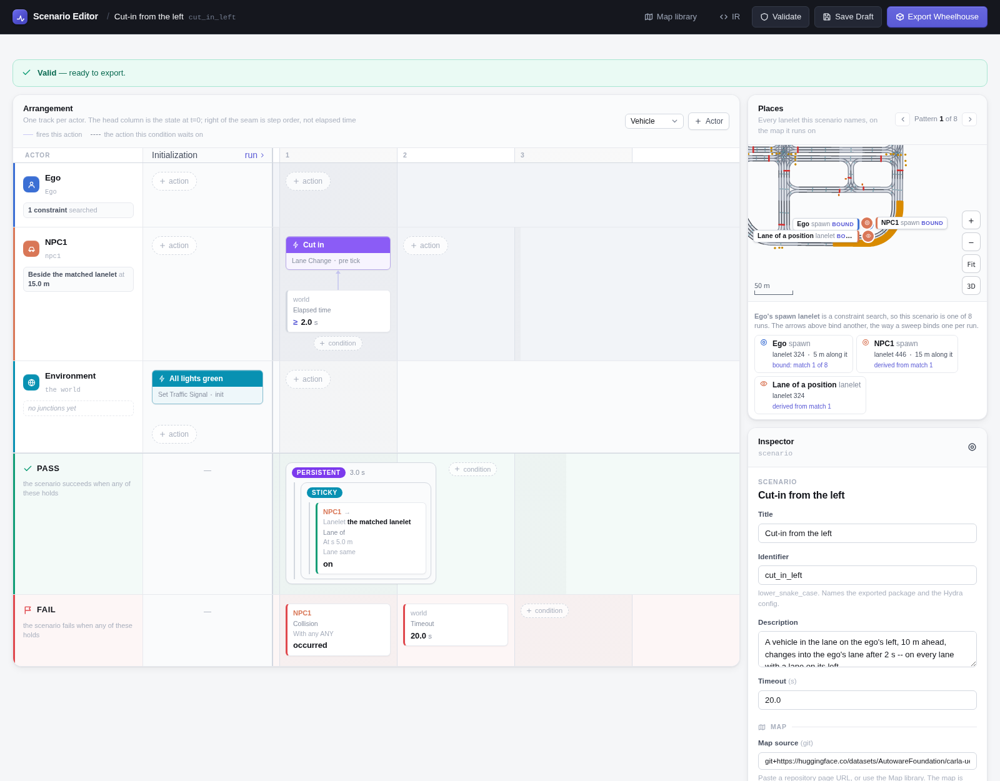

# Cut-in

A vehicle in the next lane, 10 m ahead of the ego, changes into the ego's lane
2 s into the run. The ego must not hit it -- on every lane with a lane on that
side.

```bash
# Every case on the map, one run each
uv run scenario --multirun hydra/sweeper=lanelet_constraint \
    scenario=cut_in/left map=<map>
```

## Scenario

| | |
|---|---|
| **Ego** | Constraint search: a lane with a lane on the cut-in side, not in a junction, at least 60 m long, excluding the map's lanelets with no 3D model. 5 m along it, 30 km/h. |
| **NPC1** | *Beside the matched lanelet*, on the cut-in side: the lane next to the ego's. 15 m along it, 30 km/h. |
| **Initialization** | Every traffic light green. |
| **NPC1, after 2 s** | Change lane towards the ego. |
| **Pass** | 3 s have passed since NPC1 reached the ego's OpenDRIVE lane (*lane of a position*: the matched lanelet at the ego's spawn, the same lane), with no collision. |
| **Fail** | The ego hits NPC1, or 20 s pass. |

## Variants

=== "From the left"

    

    `scenario=cut_in/left` -- a lane on the ego's left; NPC1 changes right.

    <video controls muted playsinline width="100%" src="../media/cut_in_left.mp4"></video>

    *Town10HD_Opt, the first case: the search matched lanelet 324, where the ego starts; NPC1 starts beside it on lanelet 446. Result: PASSED.*

=== "From the right"

    

    `scenario=cut_in/right` -- a lane on the ego's right; NPC1 changes left.

    <video controls muted playsinline width="100%" src="../media/cut_in_right.mp4"></video>

    *Town10HD_Opt, the first case: the search matched lanelet 446, where the ego starts; NPC1 starts beside it on lanelet 324. Result: PASSED.*

## Parameters

| Parameter | Value |
|---|---|
| NPC1 ahead of the ego | 10 m (at s = 15 m) |
| NPC1 and ego initial speed | 30 km/h |
| Cut-in after | 2 s |
| Held in the ego's lane for | 3 s |
| Lanelet at least | 60 m |
| Timeout | 20 s |
