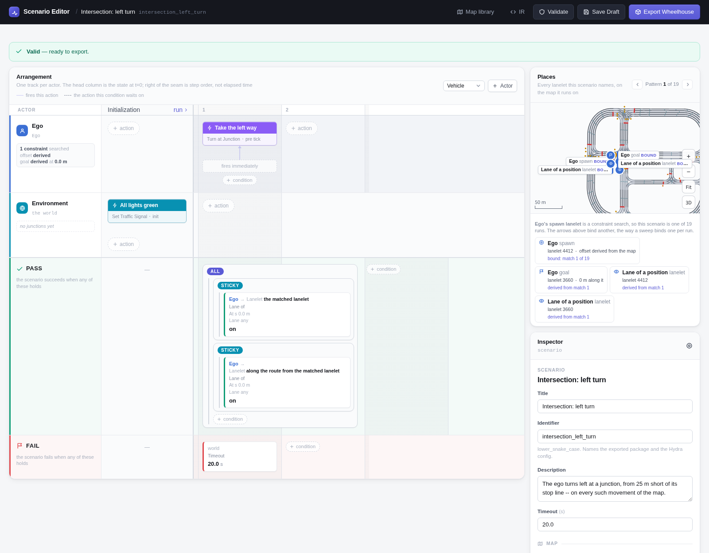
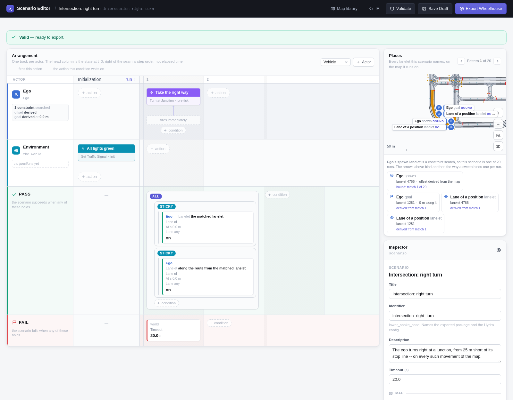
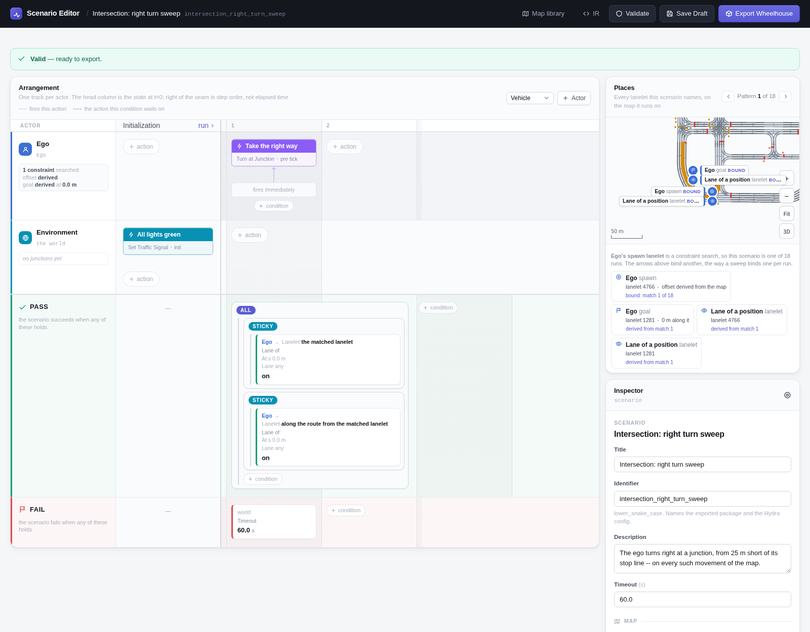
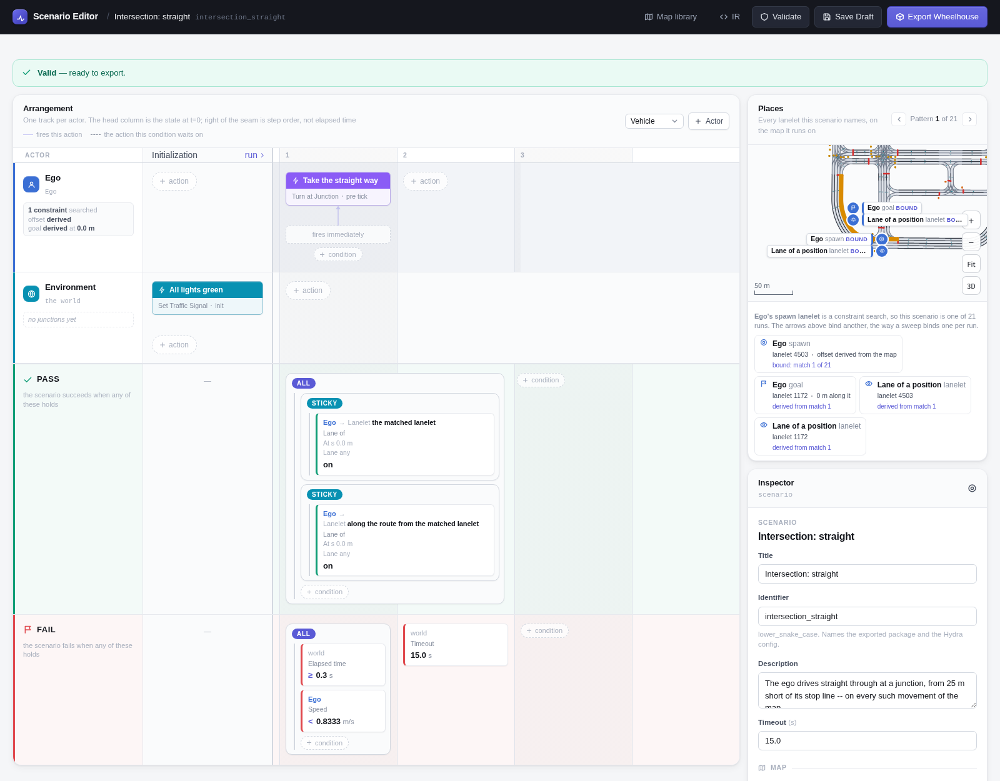

# Intersection Passing

The ego approaches a junction from 25 m short of its stop line and takes one
movement through it -- left, right or straight on -- on every junction
movement of that kind on the map. Every light is green, so nothing stops it.

```bash
uv run scenario scenario=intersection_passing/left_turn map=<map>
```

## Scenario

| | |
|---|---|
| **Ego** | Constraint search: a junction lanelet whose `turn_direction` is the movement, with a stop line at its start (see the variants), excluding the map's lanelets with no 3D model. Position *before stop line*: 25 m short of it -- which walks back onto the lane that approaches the junction, where the run starts. Goal *from the search*: the lanelet after the junction lanelet. |
| **Initialization** | Every traffic light green. |
| **Ego, from the start** | Turn at the next junction, in the movement's direction. |
| **Pass** | The ego has been on the road of the junction lanelet (*the matched lanelet*), *and* on the road of the lane it comes out on (*along the route*, one step on). Any lane of each road counts. |
| **Fail** | The timeout -- and, going straight, slowing below 3 km/h after 0.3 s. |

## Variants

=== "Left"

    

    `scenario=intersection_passing/left_turn` -- `turn_direction: left`, a
    stop line at its start (a signal's or a stop sign's), 20 km/h, 20 s.

    <video controls muted playsinline width="100%" src="../media/intersection_left_turn.mp4"></video>

    *Town10HD_Opt, the first case: the search matched lanelet 4412 and the ego starts on lanelet 5975, 15.2 m along it. Result: PASSED.*

=== "Right"

    

    `scenario=intersection_passing/right_turn` -- `turn_direction: right`, a
    stop line at its start, 20 km/h, 20 s.

    <video controls muted playsinline width="100%" src="../media/intersection_right_turn.mp4"></video>

    *Town10HD_Opt, the first case: the search matched lanelet 4766 and the ego starts on lanelet 3235, 7.0 m along it. Result: PASSED.*

=== "Right, from a standstill"

    

    `scenario=intersection_passing/right_turn_sweep` -- `turn_direction:
    right` at a signalised junction only (a traffic-light stop line), starting
    at 0 km/h, so the ego has to pull away as well as steer; 60 s.

    <video controls muted playsinline width="100%" src="../media/intersection_right_turn_sweep.mp4"></video>

    *Town10HD_Opt, the first case: the search matched lanelet 4766 and the ego starts on lanelet 3235, 7.0 m along it. Result: PASSED.*

=== "Straight"

    

    `scenario=intersection_passing/straight` -- `turn_direction: straight` at
    a signalised junction only, 5 km/h, 15 s. Also fails if the ego drops below
    3 km/h after 0.3 s: with every light green it never has to stop.

    <video controls muted playsinline width="100%" src="../media/intersection_straight.mp4"></video>

    *Town10HD_Opt, the first case: the search matched lanelet 4503 and the ego starts on lanelet 860, 3.0 m along it. Result: PASSED.*

## Parameters

| Parameter | Left | Right | Right, standstill | Straight |
|---|---|---|---|---|
| Junction lanelet | `turn_direction: left` | `right` | `right` | `straight` |
| Stop line at its start | any | any | a signal's | a signal's |
| Spawn | 25 m before it | 25 m | 25 m | 25 m |
| Ego initial speed | 20 km/h | 20 km/h | 0 km/h | 5 km/h |
| Minimum speed | -- | -- | -- | 3 km/h, after 0.3 s |
| Timeout | 20 s | 20 s | 60 s | 15 s |
