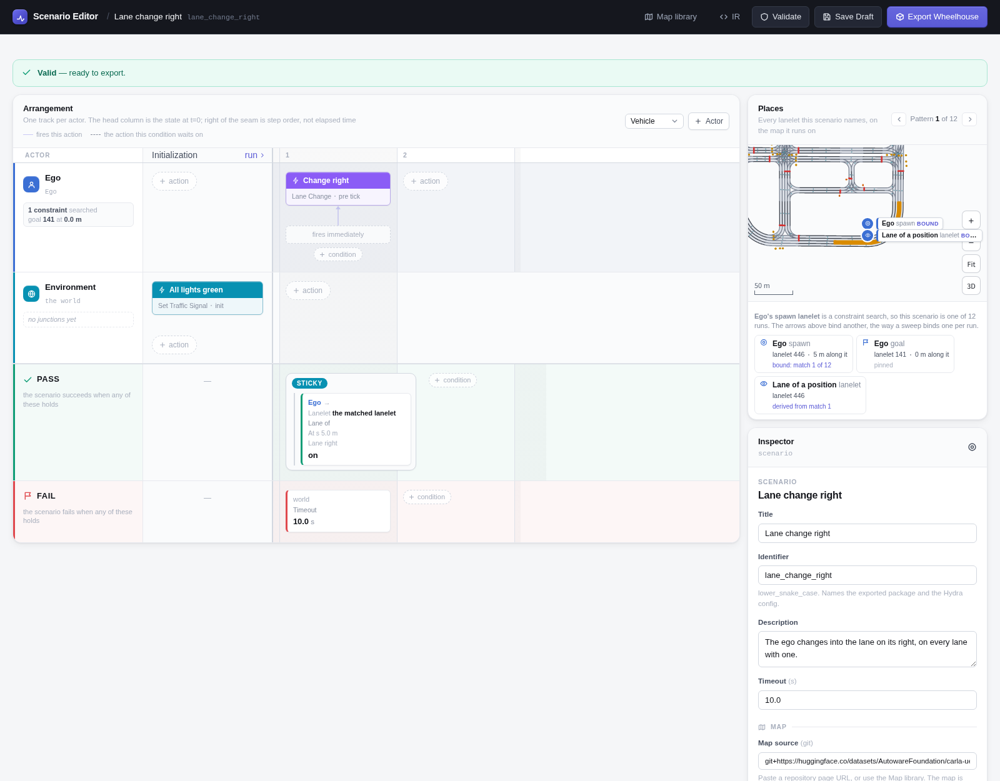
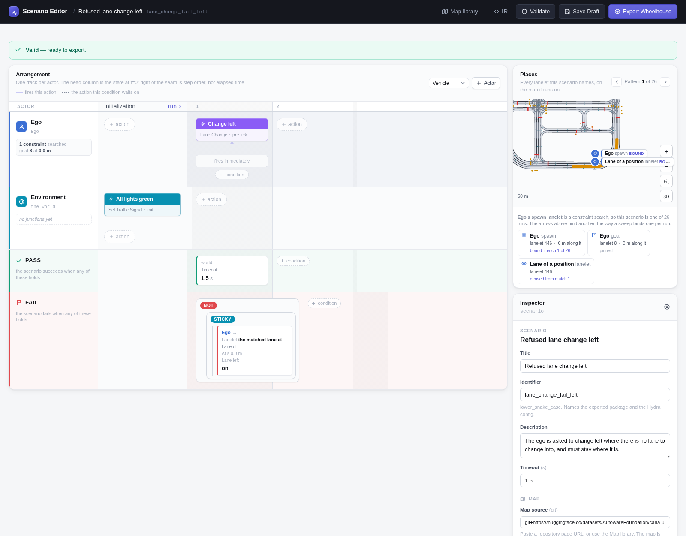
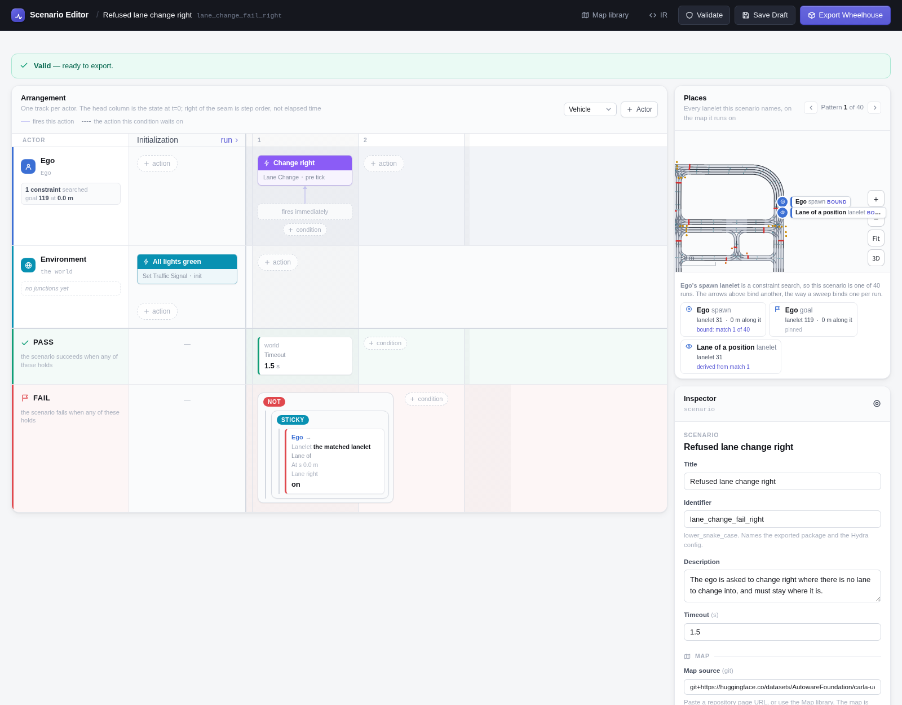

# Lane Change

The ego is told to change lane as soon as the run starts. Where there is a lane
to change into, it has to end up in it; where there is none, it has to stay
where it is.

```bash
uv run scenario scenario=lane_change/left map=<map>
uv run scenario scenario=lane_change_fail/left map=<map>
```

## Scenario

| | |
|---|---|
| **Ego** | Constraint search: a lane that is not in a junction and is long enough, excluding the map's lanelets with no 3D model -- with a lane on that side to change into, or, for the refused change, without one. 1 km/h. |
| **Initialization** | Every traffic light green. |
| **Ego, from the start** | Change lane, left or right. |
| **Pass** | Changing: the ego has been on the OpenDRIVE lane beside the one it started on (*lane of a position*: the matched lanelet at the spawn, the lane to its left or right). Refusing: the timeout passes. |
| **Fail** | Changing: the timeout. Refusing: the ego reaches that lane. |

The lane checked is the OpenDRIVE lane next to the spawn's, anywhere along its
road, rather than the lanelet next to the spawn's: a refused change has no
such lanelet to name.

## Variants

=== "Left"

    

    `scenario=lane_change/left` -- a lane on the left, at least 30 m long;
    10 s.

    <video controls muted playsinline width="100%" src="../media/lane_change_left.mp4"></video>

    *Town10HD_Opt, the first case: the search matched lanelet 324, where the ego starts. Result: PASSED.*

=== "Right"

    

    `scenario=lane_change/right` -- a lane on the right, at least 30 m long;
    10 s.

    <video controls muted playsinline width="100%" src="../media/lane_change_right.mp4"></video>

    *Town10HD_Opt, the first case: the search matched lanelet 446, where the ego starts. Result: PASSED.*

=== "Refused, left"

    

    `scenario=lane_change_fail/left` -- no lane on the left, at least 15 m
    long; passes after 1.5 s in the lane it started in.

    <video controls muted playsinline width="100%" src="../media/lane_change_fail_left.mp4"></video>

    *Town10HD_Opt, the first case: the search matched lanelet 446, where the ego starts. Result: PASSED. The timeout is 8 s here rather than 1.5 s, so there is something to see.*

=== "Refused, right"

    

    `scenario=lane_change_fail/right` -- no lane on the right, at least 10 m
    long; passes after 1.5 s in the lane it started in.

    <video controls muted playsinline width="100%" src="../media/lane_change_fail_right.mp4"></video>

    *Town10HD_Opt, the first case: the search matched lanelet 31, where the ego starts. Result: PASSED. The timeout is 8 s here rather than 1.5 s, so there is something to see.*

## Parameters

| Parameter | Left | Right | Refused left | Refused right |
|---|---|---|---|---|
| Lane on that side | yes | yes | no | no |
| Lanelet at least | 30 m | 30 m | 15 m | 10 m |
| Spawn | 5 m along it | 5 m | 0 m | 0 m |
| Ego initial speed | 1 km/h | 1 km/h | 1 km/h | 1 km/h |
| Timeout | 10 s (fail) | 10 s (fail) | 1.5 s (pass) | 1.5 s (pass) |
