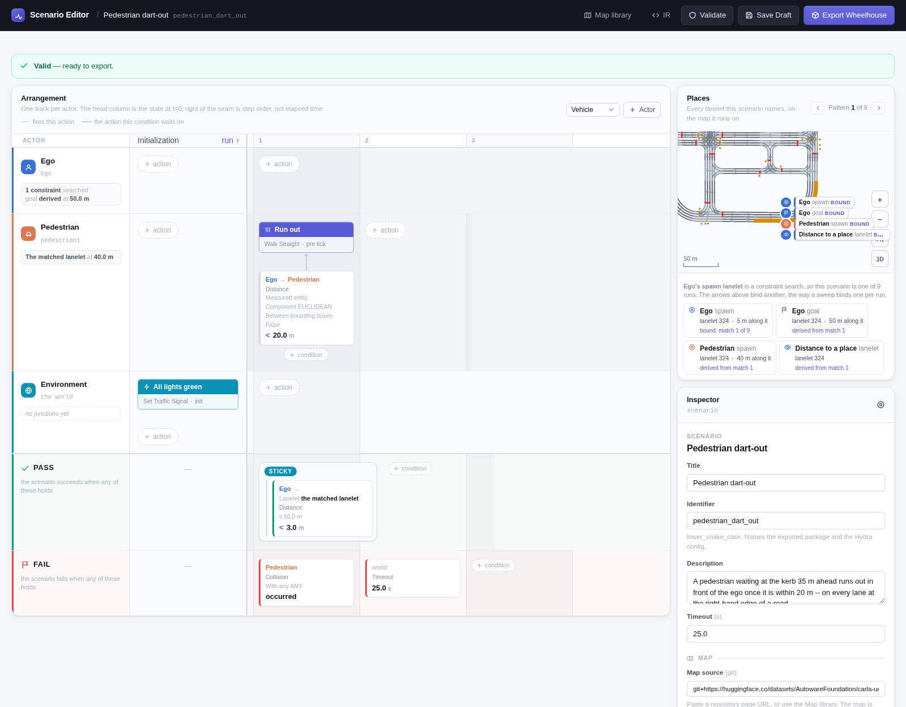

# Pedestrian Dart-out

A pedestrian waits at the kerb 35 m ahead of the ego and runs out across its
lane once the ego is within 20 m. The ego must not hit them -- on every lane at
the right-hand edge of a road, where the pedestrian steps straight off the kerb
into it.

```bash
# Every case on the map, one run each
uv run scenario --multirun hydra/sweeper=lanelet_constraint \
    scenario=pedestrian_dart_out/pedestrian_dart_out map=<map>
```

## In the Scenario Editor



## Scenario

| | |
|---|---|
| **Ego** | Constraint search: a lane with no lane on its right, not in a junction, at least 55 m long, excluding the map's lanelets with no 3D model. 5 m along it, 30 km/h. Goal *from the search*: 50 m along the matched lanelet, past the crossing. |
| **Pedestrian** | On *the matched lanelet* -- the ego's -- 40 m along it, 3 m to the right of its centre, turned 90&deg; to face across the lane. A walker CARLA refuses inside the kerb is tried again higher up. |
| **Initialization** | Every traffic light green. |
| **Pedestrian, once the ego is within 20 m** | Walk straight ahead at 2 m/s. |
| **Pass** | The ego has come within 3 m of the point 50 m along its lane, 10 m past the crossing. |
| **Fail** | The ego hits the pedestrian, or 25 s pass. |

## Parameters

| Parameter | Value |
|---|---|
| Pedestrian ahead of the ego | 35 m (at s = 40 m) |
| Off the lane's centre | 3 m to the right |
| Runs out when the ego is within | 20 m |
| Walking speed | 2 m/s |
| Passed once within 3 m of | 10 m past the crossing (s = 50 m) |
| Ego initial speed | 30 km/h |
| Timeout | 25 s |

## Result

<video controls muted playsinline width="100%" src="../media/pedestrian_dart_out.mp4"></video>

*Town10HD_Opt, the first case: the search matched lanelet 324, where the ego starts. Result: PASSED.*
