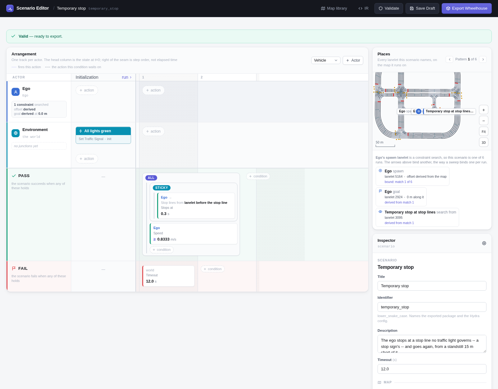

# Temporary Stop

The ego starts at a standstill 15 m short of a stop line that no traffic light
governs -- a stop sign's. It has to stop at the line and then go again -- on
every such stop line of the map.

```bash
# Every case on the map, one run each
uv run scenario --multirun hydra/sweeper=lanelet_constraint \
    scenario=temporary_stop/temporary_stop map=<map>
```

## In the Scenario Editor



## Scenario

| | |
|---|---|
| **Ego** | Constraint search: a lanelet with a stop line that is not a traffic light's, excluding the map's lanelets with no 3D model. Position *before stop line*: 15 m short of it, on the lanelet before when the line is nearer its lanelet's start than that. Goal *from the search*: the lanelet after the matched one, past the line. |
| **Initialization** | Every traffic light green. |
| **Pass** | The ego has made a temporary stop -- under 0.1 m/s for 0.3 s within 5 m of a stop line -- *and* is moving at 3 km/h again. The stop lines are read off the map, from the lanelet the ego starts on and up to three after it (*lanelet before the stop line*, from the search). |
| **Fail** | 12 s pass. |

## Parameters

| Parameter | Value |
|---|---|
| Spawn | 15 m before the stop line |
| Ego initial speed | 0 km/h |
| Stopped below | 0.1 m/s |
| Held for | 0.3 s |
| Within | 5 m of the stop line |
| Restart speed | 3 km/h |
| Stop lines searched | the spawn lanelet and 3 lanelets on |
| Timeout | 12 s |

## Result

<video controls muted playsinline width="100%" src="../media/temporary_stop.mp4"></video>

*Town10HD_Opt, the first case: the search matched lanelet 5164 and the ego starts on lanelet 3095, 39.0 m along it. Result: PASSED.*
