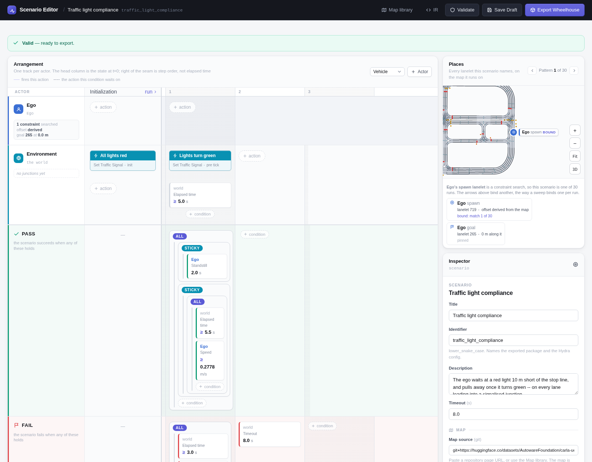

# Traffic Light Compliance

The ego starts at a standstill 10 m short of a signalised stop line with every
light red. It has to stay put while the light is red, and pull away once it
turns green 5 s in -- on every lane that leads into a signalised junction.

```bash
uv run scenario scenario=traffic_light_compliance/traffic_light_compliance map=<map>
```

## In the Scenario Editor



## Scenario

| | |
|---|---|
| **Ego** | Constraint search: a lanelet *before* a junction lanelet that has a traffic-light stop line, excluding the map's lanelets with no 3D model. Position *before stop line*: 10 m short of it. Goal: up the road, past the junction. |
| **Initialization** | Every traffic light red. |
| **After 5 s** | Every traffic light green. |
| **Pass** | Both have happened: the ego stood still for 2 s, *and* after 5.5 s it was moving at 1 km/h or more. |
| **Fail** | The ego moves at 1 km/h or more between 3 s and 4.9 s, while the light is still red -- or 8 s pass. |

## Parameters

| Parameter | Value |
|---|---|
| Light turns green after | 5.0 s |
| Must have stood still for | 2.0 s (5.0 s minus the 3.0 s it may take to settle) |
| Counts as moving from | 1 km/h |
| Ego initial speed | 0 km/h |
| Spawn | 10 m before the stop line |
| Timeout | 8 s |

!!! note
    On Nishi-Shinjuku the search also leaves out lanelet 222, where CARLA's
    TrafficManager moves the ego onto another lane in the junction.

## Result

<video controls muted playsinline width="100%" src="../media/traffic_light_compliance.mp4"></video>

*Town10HD_Opt, the first case: the search matched lanelet 719, where the ego starts. Result: PASSED.*
