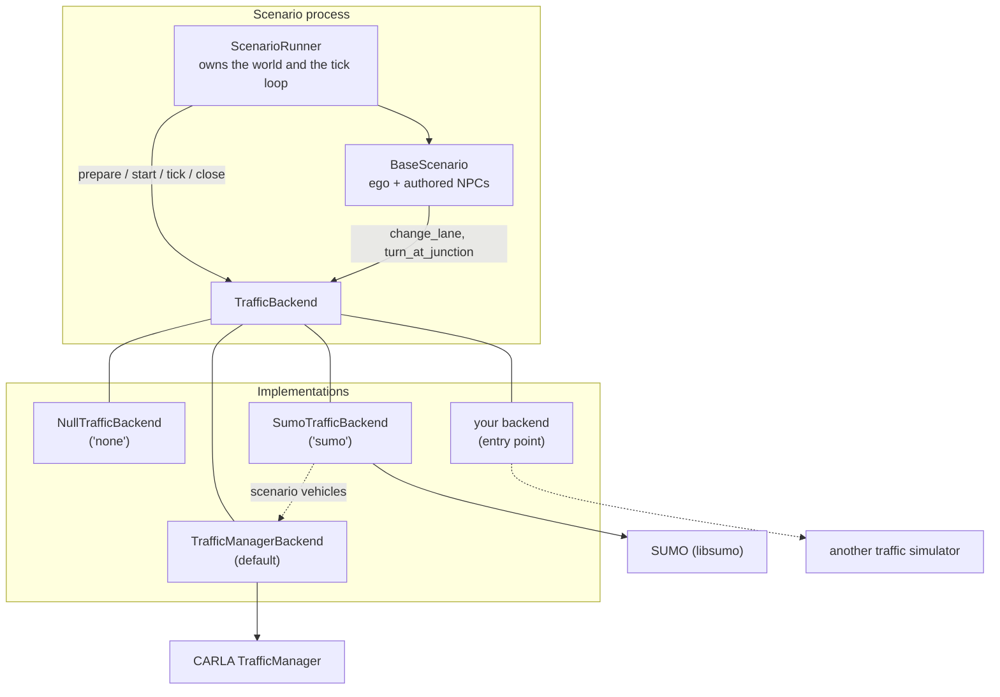

# Traffic Backends

The vehicles in a scenario come from three places, and only two of them are the
scenario's own:

- the **ego**, driven by its entity — see [External Driver Interface](driver_interface.md);
- the **authored NPCs** a scenario spawns in `setup()`;
- the **ambient traffic** that fills the rest of the road network.

A **traffic backend** owns the third kind outright and answers the manoeuvre
intents asked of the second. CARLA's TrafficManager is one such backend and is
the default. This page describes the seam, how to select a backend, and how to
write one — a microscopic traffic simulator such as SUMO, a replay of recorded
traffic, or anything else that can put vehicles on a road.

## Architecture



Two rules hold for every backend:

**One authority per vehicle.** A vehicle a backend owns is not driven by anything
else. `ScenarioRunner` passes the actors that are under external control — an
Autoware ego, a policy-driven ego — to `start()` as `skip_actor_ids`, so the rule
is data the backend is given rather than a special case it has to know about.

**An intent is not a mechanism.** `change_lane` is what the *scenario* means;
`tm.force_lane_change` and `traci.vehicle.changeLane` are what two backends do
about it. Entities ask for the first and never name the second, which is why
actions work unchanged whatever drives the vehicle.

## Selecting a backend

The `traffic` config group chooses one:

```bash
# CARLA's TrafficManager (the default — nothing to pass)
uv run scenario scenario=intersection_passing/left_turn

# No traffic model at all: only the ego and the scenario's own cars move
uv run scenario scenario=intersection_passing/left_turn traffic=none
```

| Backend | Behaviour |
| --- | --- |
| `traffic_manager` (default) | CARLA's TrafficManager drives every vehicle that is not under external control. |
| `none` | Nothing is driven and no ambient vehicle is created. |
| `sumo` | SUMO fills the road with its own traffic, co-simulated on the world's road network; see [The SUMO backend](#the-sumo-backend). Needs the `sumo` extra. |

!!! warning "`traffic=none` and the default ego"

    `ego.entity=autopilot` (the default) means *the traffic backend drives the
    ego*, so under `traffic=none` the ego does not move and the run ends on its
    timeout. Pair `traffic=none` with an ego that drives itself —
    `ego.entity=autoware` or `ego.entity=carla_driver` — or with a scenario that
    steers its vehicles itself. The backend logs how many vehicles it is leaving
    standing, so the log says why nothing moved.

A backend's own settings live under `traffic.options` and are passed to it
verbatim, so a backend from another package needs no change to this package's
config:

```yaml
traffic:
  backend: traffic_manager
  options:
    port: 8100
```

```bash
# 8101 rather than the default 8100: a second TrafficManager, so two runs
# can share one machine without steering each other's traffic.
uv run scenario traffic.options.port=8101
```

`traffic_manager.port` — where the port lived before this group existed, and what
exported scenario packages still set — keeps deciding the port when
`traffic.options.port` is left unset.

## The lifecycle

`ScenarioRunner` calls these at fixed points of a run, beside the ego entity's
own hooks:

| Method | When |
| --- | --- |
| `prepare(context)` | Before `setup()`, nothing spawned yet. Put a simulator in step, seed it, or refuse the run. |
| `adopt(entity)` | As the ego and each authored NPC join the run. The vehicle stays the scenario's. |
| `start(world, skip_actor_ids=…)` | After warm-up and the init phase, immediately before the scenario clock starts. |
| `tick(world, elapsed)` | Once per `world.tick()`. A backend driving a second simulator steps it exactly once here. |
| `close()` | During teardown, while the world is still alive. Called even when the run failed. |

One backend serves a whole queue: `ScenarioQueue` builds one runner, so over a
batch the real sequence is `prepare … close, prepare … close`, with a different
scenario — and possibly a different map — each time. `close()` is the end of a
*run*, not the end of the object: forget every vehicle created and every entity
adopted, and be ready to `prepare()` again.

`TrafficContext`, handed to `prepare()`, carries the CARLA client and world, the
map name, the OpenDRIVE the run installed, the simulation step, the scenario's
random seed and the run's output directory — everything a second simulator needs
to line itself up with the CARLA one.

Two promises matter:

- `prepare()` is the place to **fail loudly**. Raise `TrafficBackendUnavailable`
  when the simulator behind the backend is not installed, naming the extra that
  installs it; nothing has been spawned yet, so the run costs nothing.
- `tick()` and the manoeuvres must **never raise**. A traffic model that cannot
  do something logs a warning; an exception there would end a scenario that is
  otherwise perfectly valid. The base class's defaults already behave this way.

## Writing a backend

Subclass `TrafficBackend`, override what you actually do, and register a factory
under a name:

```python
from typing import Any, Collection, Mapping

from autoware_carla_scenario import TrafficBackend, TrafficContext, register_backend


class MySimulatorBackend(TrafficBackend):
    name = "my_simulator"

    def __init__(self, options: Mapping[str, Any]) -> None:
        self._address = options.get("address", "localhost:9999")

    def prepare(self, context: TrafficContext) -> None:
        # Match the simulation step so the two clocks cannot drift, and derive
        # the road network from the OpenDRIVE the CARLA world is running.
        # The map of the run: `xodr_path` is the OpenDRIVE CARLA is running, and Phase B
        # adds `lanelet2_path` for a backend whose own network is built from Lanelet2.
        self._connect(context.fixed_delta_seconds, context.xodr_path, context.random_seed)

    def start(self, world: Any, *, skip_actor_ids: Collection[int] = ()) -> None:
        self._externally_driven = set(skip_actor_ids)

    def tick(self, world: Any, elapsed: float) -> None:
        self._publish_carla_vehicles(world)   # so my traffic reacts to the ego
        self._step_once()                      # exactly one step per world tick
        self._mirror_into_carla(world)

    def close(self) -> None:
        self._disconnect()


def register() -> None:
    register_backend("my_simulator", MySimulatorBackend)
```

From your own package, advertise it so `traffic.backend=my_simulator` resolves
without an import anywhere in this repository:

```toml
[project.entry-points."autoware_carla_scenario.traffic_backends"]
my_simulator = "my_package:register"
```

### Answering manoeuvre intents

A backend that can steer the vehicles it drives overrides the three intent
methods. They receive the entity, so a backend can read the actor and record its
own bookkeeping on the vehicle rather than in a table of its own:

```python
    def change_lane(self, entity, world, direction) -> None: ...
    def lane_change_finished(self, entity, world) -> bool: ...
    def turn_at_junction(self, entity, world, direction, **kwargs) -> None: ...
```

`direction` is `LaneChangeDirection` or `TurnDirection` — intents, not CARLA
values. A backend that has no answer for one simply does not override it: the
base class logs that the intent is unavailable and the vehicle keeps doing what
it was doing, which is also what `LaneChangeAction` sees when it asks whether the
manoeuvre finished.

## Using a backend from Python

A scenario run built in code takes the backend the same way it takes the ego:

```python
from autoware_carla_scenario import NullTrafficBackend, ScenarioQueue

queue = ScenarioQueue(map_name="Town10HD_Opt", traffic_backend=NullTrafficBackend())
```

`ScenarioQueue` passes it to the `ScenarioRunner` it builds, and one backend
serves every scenario in the queue — the same way one CARLA server does.

## Background traffic

Vehicles no scenario entity stands for are created and removed by two actions
modelled on OpenSCENARIO's `TrafficSourceAction` and `TrafficSinkAction`. Where
OpenSCENARIO gives a source or sink a position and a radius, these take
**lanelet constraints** -- the vocabulary a sweep picks its cases with -- so the
same action means "every lane outside a junction" on any map:

```python
from autoware_carla_scenario import ElapsedTimeCondition, TrafficSinkAction, TrafficSourceAction

not_in_junction = [{"type": "not", "constraint": {"type": "is_junction"}}]

# Placed during initialization, then no more: register_init runs once.
self.register_init(TrafficSourceAction(not_in_junction, initial_vehicles=20))

# Six a minute during the first 30 s of the run, at most 30 on the road.
self.register_pre_tick(
    TrafficSourceAction(
        not_in_junction,
        vehicles_per_minute=6.0,
        max_vehicles=30,
        until=ElapsedTimeCondition(30.0, label="first_30s"),
    )
)

# Removed at the ends of the map's roads for the whole run.
self.register_pre_tick(
    TrafficSinkAction(
        [{"type": "not", "constraint": {"type": "previous_of",
          "constraints": [{"type": "lanelet_length", "value": 0.0}]}}]
    )
)
```

- **When they act** is the trigger (`condition`) and the end condition
  (`until`), as for every action. With no `until` a source or sink runs until
  the scenario ends, as OpenSCENARIO's do; with one, it stops on the first tick
  `until` fires. Registered with `register_init`, a source places its
  `initial_vehicles` once, during initialization, and never again.
- **Who drives them** is the backend: `spawn_background`, `background_vehicles`
  and `remove_background` on `TrafficBackend`. Under `traffic=sumo` they are
  SUMO vehicles that wander the network (a random way out at each junction) and
  are mirrored into CARLA like the rest of SUMO's traffic; ones placed during
  initialization have SUMO's warm-up to spread out. Under
  `traffic=traffic_manager` they are CARLA vehicles on autopilot. `none` creates
  none, with a warning.
- **`speed_kmh`** is the speed they drive at, at most. **`max_vehicles`** counts
  every background vehicle on the road, whichever source made it.

The examples take all of this from the config, for any scenario:

```bash
uv run scenario scenario=intersection_passing/left_turn map=town10hd_opt \
  traffic=sumo background_traffic.enabled=true
# Only what initialization places:
uv run scenario ... background_traffic.enabled=true background_traffic.source.vehicles_per_minute=0
# Keep adding for the first 20 s only:
uv run scenario ... background_traffic.enabled=true background_traffic.source.stop_after_seconds=20
```

`background_traffic` (in `examples/conf/config.yaml`) is off by default, and the
SUMO backend's own `ambient` randomTrips demand is off in
`conf/traffic/sumo.yaml`, so an example runs with no traffic but its own unless
asked.

## Why this exists

CARLA's TrafficManager is a good default for a handful of scripted NPCs and the
wrong tool for dense, demand-driven flow. Microscopic traffic simulators model
car-following, gap acceptance and route choice in ways it does not, and "does the
stack merge into a saturated flow at this intersection?" is a question about
traffic rather than about three scripted cars. The seam is what makes answering
it possible without a second scenario framework: the same map, the same scenario
document, the same conditions and the same result format, with the traffic model
swapped.

## The SUMO backend

`traffic=sumo` co-simulates [SUMO](https://eclipse.dev/sumo/) with the CARLA
world. It needs the `sumo` extra (`autoware-carla-scenario[sumo]`: SUMO,
libsumo and roadgen, all wheels); without it the run is refused in `prepare()`,
before anything is spawned.

```bash
uv run scenario scenario=lane_change/left map=town10hd_opt traffic=sumo
uv run scenario ... traffic=sumo traffic.options.ambient.vehicles_per_hour=1800
uv run scenario ... traffic=sumo traffic.options.scenario_vehicles=sumo
uv run scenario ... traffic=sumo traffic.options.fcd_output=true   # <output>/sumo/fcd.xml
```

**The network** is the world's own road network. The backend takes the
OpenDRIVE the world runs (the file the run installed, or
`world.get_map().to_opendrive()`), converts it with
[roadgen](https://github.com/hakuturu583/hdmap_generator) into netconvert's
plain-XML input and builds it with netconvert. The result is cached under
`~/.cache/autoware_carla_scenario/sumo/`, keyed by the OpenDRIVE and the tool
versions, so a map is converted once. roadgen writes the network without offset
normalisation, so SUMO's x/y are OpenDRIVE's and CARLA's are the same with y
mirrored. `traffic.options.net_path` runs on an existing `.net.xml` instead.

!!! note
    CARLA's maps bend the OpenDRIVE schema in a few places roadgen's strict
    parser refuses (`<userData>` without `code`, `<roadMark>` without `color`,
    objects of type `-1`, `<cornerLocal>` without `height`); the backend
    strips or fills those before converting. An OpenDRIVE whose junctions name
    connections to roads they do not list (the Nishishinjuku map's) is refused
    by roadgen's validation.

**Ownership** follows the seam's rule: the scenario owns what it authored.

| Vehicle | Driven by | In SUMO |
| --- | --- | --- |
| Ego (`autoware`, `carla_driver`) | its entity | published: moved to its CARLA pose every tick |
| Scenario NPCs, autopilot ego | the TrafficManager (`scenario_vehicles=traffic_manager`, default), or SUMO (`scenario_vehicles=sumo`) | published, or driven |
| Ambient traffic (`randomTrips.py`) | SUMO | native; mirrored into CARLA |
| Pedestrians (`walker.pedestrian.*`, e.g. `WalkStraightAction`) | CARLA | published as SUMO persons (`publish_walkers`, on by default) |

A published vehicle has SUMO's speed and lane-change control switched off, so
SUMO traffic sees it where CARLA has it and reacts to it. With the default the
scenario's NPCs behave exactly as under the `traffic_manager` backend, while
SUMO fills the rest of the road.

A published pedestrian is a SUMO person moved to its CARLA pose every tick
with `moveToXY` and `keepRoute` 6: placed exactly there, on whichever lane is
there, footway or road. A SUMO vehicle brakes for a person on its lane, on a
crossing or anywhere else, or changes lanes round it. A person has to be added
on an edge with a footway -- SUMO aborts the whole simulation when one is moved
off an edge without -- so a pedestrian with no footway within 50 m (or on a
network with none) is left out, with a warning.

**Stepping**: one SUMO step per CARLA tick, with the step length set to the
world's `fixed_delta_seconds` and the seed to the scenario's. CARLA poses are
published before SUMO steps; SUMO's result is applied to the actors after it.
How a CARLA vehicle follows its SUMO vehicle is `vehicle_control`:

- `physics` (default) drives it with CARLA's vehicle physics, as TeraSim's
  `ackermann_physics` mode does. SUMO plans; each tick the car is steered towards
  a point 4-10 m ahead on SUMO's lanes (pure pursuit, offset by SUMO's lateral
  position mid lane change), and a PI throttle/brake controller with SUMO's
  acceleration as feedforward drives it at SUMO's speed, corrected by how far it
  is behind or ahead. Two CARLA 0.10 quirks are handled: its Ackermann
  controller's speed loop oscillates (so speed is controlled here and sent as
  throttle and brake), and its steering input maps onto the wheels roughly as
  51° × steer² rather than linearly (so the steer command inverts that and
  closes a loop on the car's measured curvature). A car further than
  `resync_distance_m` from its SUMO vehicle is put back on it. By default SUMO
  does not see where physics actually put the car, so gaps SUMO keeps are kept
  to within the tracking error -- on Town10 p95 1.1 m. `feedback_distance_m`
  (off by default) moves a SUMO vehicle to its car when the two are further
  apart than that, with SUMO's own `moveTo`, which takes effect at once and
  leaves SUMO planning the next step (TeraSim patches SUMO for an XY variant
  of it); inside junctions nothing is corrected. On Town10 it did not reduce
  contacts: a SUMO vehicle moved back to a lagging car is re-planned from a
  state its own model would not have reached.
  SUMO's car-following models read no curvature, so a vehicle takes a bend at
  the speed limit -- on Town10 up to ~10 m/s² sideways, more than a car under
  physics can follow. `curve_lateral_acceleration` (3.0 m/s² by default) has
  roadgen cut each edge at its bends and give every piece, and every path
  across a junction, the speed `sqrt(a / curvature)` its sharpest point allows;
  SUMO's vehicles then brake for a bend before they reach it. The pieces keep
  the edge's id on the first and `<edge>.p1`, `<edge>.p2`, … after it, and
  roadgen's trace has every one.
- `teleport` places it where its SUMO vehicle was at the start of the step and
  gives it SUMO's speed as a constant velocity (`enable_constant_velocity`),
  which carries it to where SUMO is at the end of it: exact, but the car is not
  driven by its physics.

**Traffic lights** (`traffic_light_authority`): `carla` (default) gives SUMO's
signals the states of CARLA's lights every step, so a scenario that sets the
lights sets them for SUMO's traffic too; `sumo` drives CARLA's lights from
SUMO's programs; `none` leaves each alone. CARLA's lights are applied while
SUMO warms up too, so the queues it starts with are the ones they would build.

Which SUMO signal links a CARLA light switches is read off roadgen's traces,
written beside the network when it is built: the light is the OpenDRIVE signal
of its `get_opendrive_id()`, roadgen records which map element that signal
became when it reads the OpenDRIVE (`map.xodr.trace.json`), and which SUMO links
of the junction's program that element became when it writes the network
(`network.sumo.trace.json`). A light whose signal reached no link is named in a
warning, and SUMO keeps its own program there. A network given as `net_path`
has no traces, and its links are matched geometrically instead: a light's stop
waypoints to the SUMO lane there.

On Town10HD_Opt all 15 lights match, 56 links between them; SUMO's only other
signal links are on emergency-only shoulder lanes.

**Manoeuvres** of SUMO-driven vehicles become TraCI calls: `change_lane` →
`changeLane` (SUMO obeys a solid line, and says so), `set_desired_speed` →
`setSpeed`, `turn_at_junction` → a route onto the junction's outgoing edge in
that direction. With the default, they go to the TrafficManager.

The coupling follows [TeraSim](https://github.com/autowarefoundation/TeraSim)'s
CARLA co-simulation; its adversarial behaviour generation is left to scenarios.
